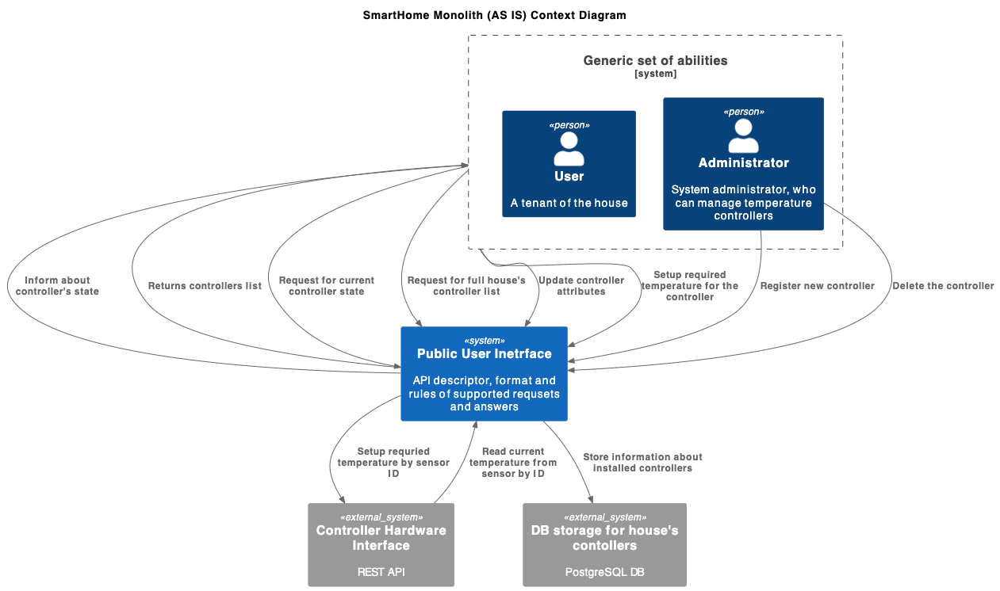
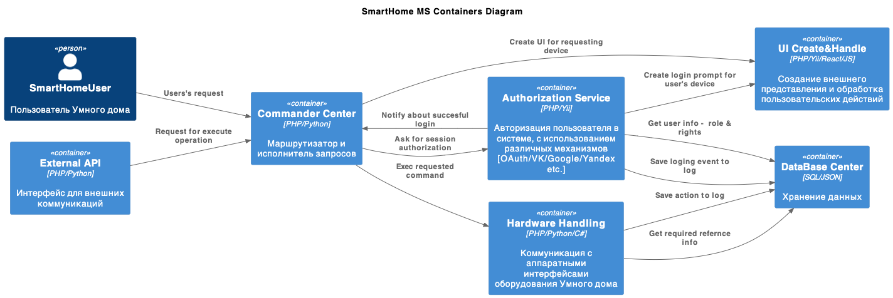
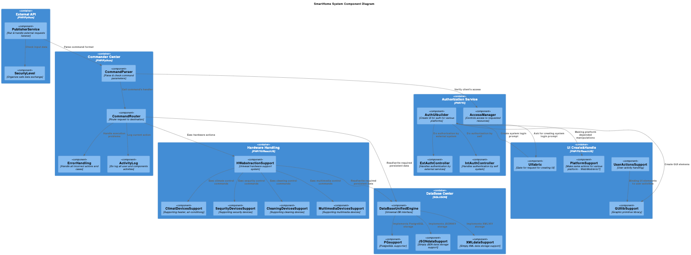
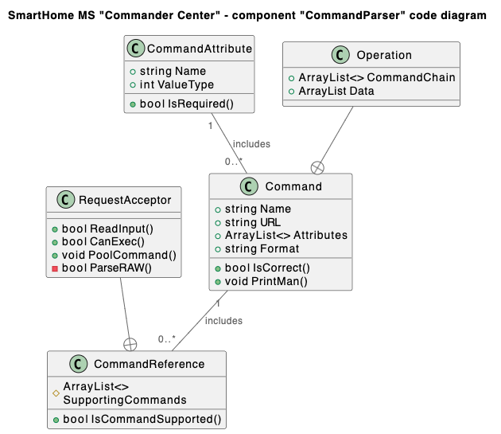
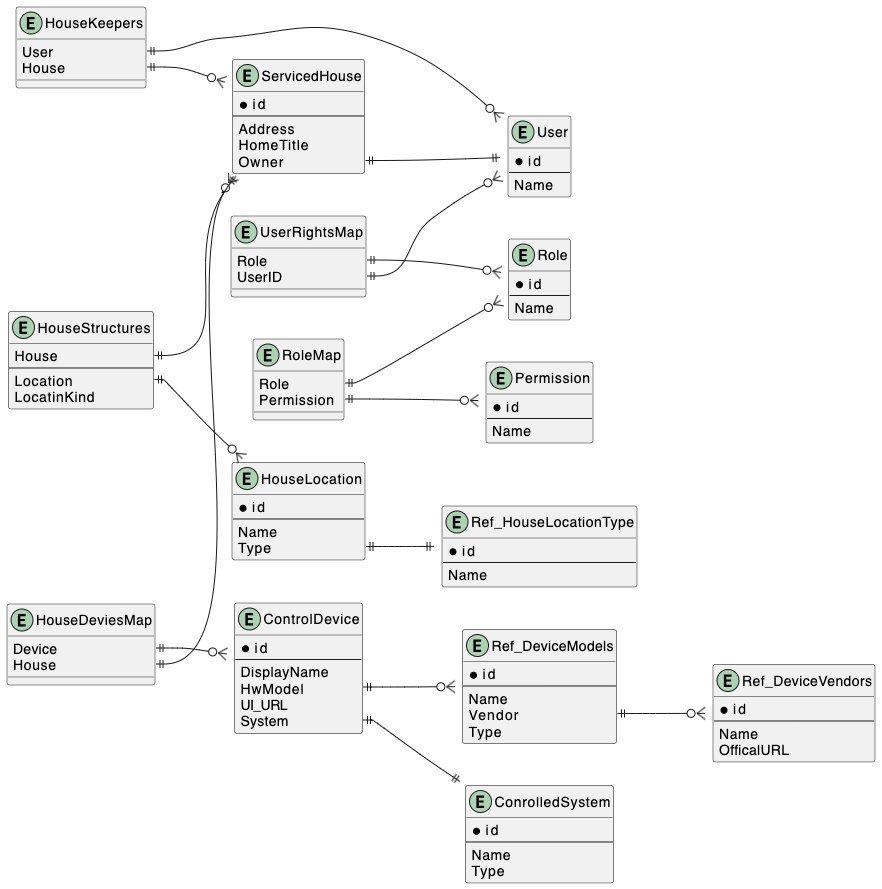

Спринт 1 - Микросервисы и документирование решений
# Задание 1. Анализ и планирование

<aside>

**Заказчик**: компания "Теплый дом".
**Область деятельности**: организация управления отоплением в отдельном доме. 
**Текущее положение вещей**: реализовано предоставление пользователям управления отоплением помещений - получение актуальной и установка требуемой температуры.
В настоящий момент у компании 100 - web-клиентов и к системе подключено 100 контроллеров (термометр+реле) управления температурой. 
**Цель**: компания планирует развивать направление "умный дом". Выигран тендер на создание системы управления большого количества разных домов в различных георграфических регионах. Так же должна быть увеличена номенклатура предоставляемых сервисов управления домом, количество и их тип может варироваться в каждом объекте. В домах, которыми планируется управлять, ожидается наличие специальныъх блоки датчиков и реле. На текущий момент 50% домов уже оборудованы требуемыми блоками управления.

</aside>

### 1. Описание функциональности существующего решения

**Управление отоплением:**

- Пользователи могут:
	* зарегистрировать в системе контроллер температуры с указанием:
		* названия,   		
		* наименования помещения,
		* типа контроллера,
		* единицы измерения;
	* получить полный список зарегистрированных в системе контроллеров с их актуальным статусов на момент выполнения запроса;
	* получить информацию с датой регистрации в системе, актуальным статусом и значением темпереатуры для указанного уникальным иденификатором контроллера;
	* удалять, указанный при помощи уникального идентификатора, контроллер 
	* устанавливать требуемую температуру и текстовой статус контроллеру;
	* обновлять информацию о наименовании, типе, месте размещения, статусе, требуемой температуре, единице измерения, указанного уникальным идентификатором, контроллера.
- Система поддерживает обработку ошибочного указания некорректного идентифкатора контроллера и так же уведомление пользователя о некорретном формате входных данных. 
- В случае успешного выполнения команды, интерфейс системы таже уведомляет пользователя об этом. 

**Мониторинг температуры:**

-  Кроме получения информацмии о текущем состоянии непосредственно конкретного контроллера, система также реализует возможность чтения данных о состоянии всех контроллеров указанного помещения (по его наименованию), возвращается набор описателей, следующей структуры: 
	* наименование помещения,
	* текущее значения темпрературы контроллера,
	* единицы измерения контроллера,
	* текущего статуса контроллера,
	* время обновления информации об изменеиях контроллера,
	* строка с произольным описанием контроллера;
- Система обрабатывает некорректное указание помещения - возвращает ошибку, если наименование не указано, либо не зарегистрированно.
  

### 2. Анализ архитектуры монолитного приложения

Текущее решение представляет собой web-приложение, самостоятельно реализующее обработку HTTP-запросов.
Установка дополнительного Web-сервера или сервера приложений не требутся.
Сиcтема написана на языке Go и фактически является интерфейсом между произвольной системой отображения состояния (интерфейсом пользователя) системы отопления домом и непосредственно исполнителным механизмом управления отоплением - термометрами и регуляторами, с которым, в свою очередь коммуникация так же производится при помощи HTTP-запросов - REST API.
Так же система хранит в собственной базе данных (использована СУБЛ PostrgreSQL) информацию о зарегистрированных контроллерах управления отоплением, с возможностью получить последнее считанное с аппаратуры их состояние.
Хранение истории измерений не предусмотрено.
Внешние запросы обрабатываются последовательно, по правилу FIFO.
При старте, приложение жестко определят набор поддерживаемых URL запросов, каждому определяется обработчик, проверяющий коррекность формата, переданных в запрос данных.
Информация о текущем состоянии аппаратуры (температура и статус) получается по запросу от пользователя, никакой автоматизации не предусмотрено.

### 3. Определение доменов и границы контекстов

- ***Домен***: коммуникация с пользователем
	* Поддомен: "описание интерфейса"
	* Поддомен: "обработчики запросов"
- ***Домен***: модель данных
	* Поддомен: "менеджер структур данных"
	* Поддомен: "интерфейс с базой данных"
- ***Домен***: управление контроллером отопления
	* Поддомен: "настройка оборудование":
		* создние, 
		* удаление, 
		* корректировка параметров контролоеров отопления
	* Поддомен: "управление отоплением":
		* установка требуемой температуры, 
		* получение текущего значения температуры.

### **4. Проблемы монолитного решения**

1. Существующая версия приложения не имеет никакого разграничения прав доступа - любой пользователь, знающий URL и описание API системы может свободно отключить все отопление в доме. 
2. На каждый, управялемый компанией, дом нужно разворачивать свой экземпляр приложения. Соответственно, требуется создание некой общей системы обновления экземпляров. По сути вся система управления отоплением является "макро-мироксервисом".
3. Отсутствует автоматический мониторинг состояния контроллеров отопления.
4. Не определены максимально и минимально допустимые диапазоны устанавливаемых значений температуры, что может привести к проблемам уже физического характера - пожары, оледенение, разморозка системы и пр.
5. В случае падения (перезапуска) приложения становится полностью недоступен весь функционал - управление отоплением и настройка оборудования.

### 5. Визуализация контекста системы — диаграмма С4

# Задание 2. Проектирование микросервисной архитектуры

**Диаграмма контейнеров (Containers)**

**Диаграмма компонентов (Components)**

**Диаграмма кода (Code)**

# Задание 3. Разработка ER-диаграммы

# Задание 4. Создание и документирование API

### 1. Тип API

Т.к. количество узлов (дом + его управляемые системы), согласно постановки задачи, хоть и достаточно велико, но не бесконечно и не планируется взрывной рост, а системы достаточно инерционны и часто не требуют мгновенной реакции, смысла вводить в систему дополнительнй компонерт регулировки трафика запросов нет. Достаточно использовать синхронный API с прямыми обращениями к конкретным устройствам.
Маршрутизатор запросов в дальнейшем может быть модернизирован путем добавления перед ним броккера сообщений и переводом API на асинхронный формат обмена.

### 2. Документация API

https://github.com/vnikiforov/YaEdu/blob/warmhouse/apps/smart_home/docs/api_v1.yaml

# Задание 5. Работа с docker и docker-compose

Реализовано в docker-compose.yml
